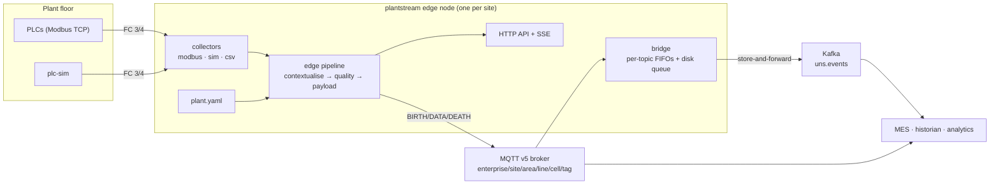
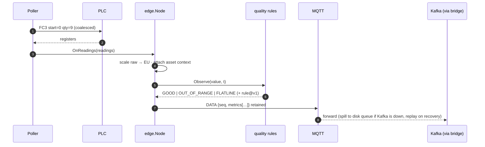

# plantstream

> Unified Namespace edge platform for manufacturing: Modbus TCP collectors → ISA-95/Sparkplug-style MQTT → quality-flagged, contextualised streams bridged to Kafka with store-and-forward. Go, zero-infra local run.

[](go.mod)
[](LICENSE)
[](https://github.com/udaykishore-resu/plantstream/actions/workflows/ci.yaml)

## Problem

Operations technology and information technology do not share data. A PLC
knows the filler runs at 480 bottles per minute; the MES, the historian, the
quality system and the data-science team each build their own poller to find
that out, each with its own idea of what "speed" means, in which unit, and
whether 480 is normal. Every plant becomes a snowflake: integration logic is
duplicated per consumer, context lives in spreadsheets, and a tag rename in
one system breaks three others months later.

The problem has resisted fixes because the usual answers make it worse. Point-
to-point integrations scale as consumers × sources. Historians centralise
storage but not meaning: they faithfully record a frozen sensor for weeks.
Cloud-first pipelines assume a WAN that plant floors do not have, and silently
drop the hours that were most interesting. And protocol translation alone does
not help — turning Modbus registers into JSON without the asset model still
leaves every consumer guessing what register 7 is.

Data quality is the quiet killer. A PLC that stopped answering, a sensor that
flatlined, a value outside its engineering range — none of these look
different from good data in a time-series database. Analytics teams discover
them after the model has been trained.

## Approach

plantstream implements the **Unified Namespace** pattern at the edge: every
signal is published *once*, with its context, on an ISA-95 topic tree that any
consumer subscribes to. One process per site does four things:

1. **Collect** from field devices through a small `Source` interface. Shipped:
   a Modbus TCP client implemented in-repo (FC 3/4, int16/uint16/int32/uint32/
   float32, ABCD/DCBA/BADC/CDAB byte orders, request coalescing), an in-process
   line simulator and a CSV replayer. OPC UA is deliberately out of scope
   ([ADR 0005](docs/adr/0005-opc-ua-out-of-scope.md)).
2. **Contextualise** using a validated `plant.yaml`: asset id, equipment class,
   unit, engineering range and scaling are stamped on every metric, so a
   message is self-describing.
3. **Judge quality deterministically.** Four versioned rules — comm, range,
   flatline, stale — flag each metric `GOOD | STALE | FLATLINE | OUT_OF_RANGE |
   BAD` and record the rule that fired (`quality.range@v1`). Verdicts are
   explainable to an operator at 3 a.m.; machine learning stays on the
   consumer side where humans can review it.
4. **Publish and bridge.** Sparkplug-B-inspired JSON (BIRTH/DATA/DEATH, per-node
   sequence numbers) goes to MQTT v5; a bridge forwards it to Kafka with a
   bounded on-disk store-and-forward queue and per-topic backpressure, so a WAN
   outage costs latency, not data.

The core is deterministic and pure (`internal/domain/...` has no I/O). External
systems sit behind `internal/ports` with a production adapter and an in-memory
twin each, so the entire pipeline runs and is tested with zero infrastructure.

## Architecture



Hot path for one poll cycle:



Full container diagram, lifecycle and failure table: [docs/architecture.md](docs/architecture.md).

## Quick start

Requires Go 1.26+. No Docker, broker or Kafka needed.

```sh
make run            # in-memory broker, two simulated lines + a CSV rig; API on :8080
```

In another terminal:

```sh
# 1. Readiness: plant loaded, broker connected, sources reporting
curl -s localhost:8080/readyz
# {"status":"ready","components":{"broker":"connected","plant":"4 assets, 12 tags","sources":"3/3 up"}}

# 2. The asset model with ISA-95 position and per-tag UNS topics
curl -s localhost:8080/v1/assets | jq '.assets[0] | {id, class, area, line, cell, tags: [.tags[].topic]}'

# 3. Latest contextualised values of the filler: value + quality + unit + engineering range
curl -s localhost:8080/v1/tags/filler-01/latest | jq '.metrics[] | {name, value, quality, unit: .properties.unit, eng_high: .properties.eng_high}'

# 4. The namespace: every topic with its current quality (the lab rig goes OUT_OF_RANGE during its burst test)
curl -s localhost:8080/v1/topics | jq '.topics[] | "\(.quality // "-")  \(.topic)"'

# 5. Per-source health
curl -s localhost:8080/v1/health/sources | jq '.sources[] | {name, type, up, polls, last_latency_ms}'

# 6. Live Sparkplug-style DATA stream for every "speed" tag (SSE; + is %2B, # is %23)
curl -sN --max-time 3 "localhost:8080/v1/stream?topic=acme/austin/%2B/%2B/%2B/speed"
```

`examples/quickstart.sh` runs the same sequence. Read a real Modbus device
instead of the simulator:

```sh
make run-modbus     # starts cmd/plc-sim on :5020 and the node with examples/plant-modbus.yaml
go run ./cmd/plc-sim -print-map   # register map of the simulated PLC
```

Stop `plc-sim` while the node runs and watch `filler-01`'s tags turn `BAD`
(`quality.comm@v1`) with their last known value; restart it and they recover.

Full stack with Mosquitto, Kafka (KRaft), OpenTelemetry Collector, plc-sim
and the on-disk queue:

```sh
make run-full
docker compose -f deploy/docker-compose.yaml exec kafka \
  /opt/kafka/bin/kafka-console-consumer.sh --bootstrap-server kafka:9092 \
  --topic uns.events --from-beginning --max-messages 3 --property print.key=true
```

### What a message looks like

Topic `acme/austin/packaging/line-1/filling/speed`, retained:

```json
{
  "type": "DATA", "timestamp": 1773500966535, "seq": 30, "node": "plc-line-1",
  "metrics": [{
    "name": "speed", "timestamp": 1773500966535, "datatype": "Float",
    "value": 480.25, "quality": "GOOD",
    "topic": "acme/austin/packaging/line-1/filling/speed",
    "properties": {
      "asset_id": "filler-01", "asset_class": "RotaryFiller", "unit": "bpm",
      "eng_low": 0, "eng_high": 600, "source": "plc-line-1",
      "description": "Line speed in bottles per minute"
    }
  }]
}
```

A non-GOOD metric adds `"quality_rule": "quality.range@v1"` to `properties`.
Each source announces itself on `acme/austin/_edge/<source>/BIRTH` (retained,
listing every metric it will publish) and says goodbye on `.../DEATH`.

### plant.yaml in one screen

```yaml
enterprise: acme
site: austin
quality: { stale_after: 5s }
sources:
  - name: plc-line-1
    type: modbus
    poll_interval: 500ms
    modbus: { address: 10.20.1.15:502, unit_id: 1, timeout: 1s }
areas:
  - name: packaging
    lines:
      - name: line-1
        cells:
          - name: filling
            assets:
              - id: filler-01
                class: RotaryFiller
                source: plc-line-1
                tags:
                  - name: speed
                    unit: bpm
                    range: { min: 0, max: 600 }
                    modbus: { function: holding, register: 0, type: float32, byte_order: ABCD }
                  - name: ambient
                    unit: degC
                    scale: { factor: 0.1 }                       # int16 tenths → °C
                    modbus: { function: input, register: 0, type: int16 }
```

Validation runs at startup and reports every problem at once (unknown fields,
duplicate topics, overlapping addresses, bad byte orders, ranges with
min ≥ max, …). Full examples: [`examples/plant.yaml`](examples/plant.yaml),
[`examples/plant-modbus.yaml`](examples/plant-modbus.yaml).

## Configuration

All settings are environment variables (12-factor). Secrets come from the
environment only; the Helm chart wires them from Kubernetes Secrets.

| Variable | Default | Description |
|---|---|---|
| `PLANTSTREAM_HTTP_ADDR` | `:8080` | HTTP API listen address |
| `PLANTSTREAM_PLANT_FILE` | `examples/plant.yaml` | Path to the site's plant.yaml |
| `PLANTSTREAM_LOG_LEVEL` | `info` | `debug` / `info` / `warn` / `error` (JSON logs) |
| `PLANTSTREAM_SHUTDOWN_TIMEOUT` | `10s` | Drain budget on SIGTERM |
| `PLANTSTREAM_STALE_CHECK_INTERVAL` | `1s` | How often the stale rule runs |
| `PLANTSTREAM_BROKER` | `memory` | `memory` (in-process pub/sub) or `mqtt` |
| `PLANTSTREAM_MQTT_URL` | `mqtt://localhost:1883` | MQTT v5 broker (`mqtt://`, `tls://`, `ws://`) |
| `PLANTSTREAM_MQTT_CLIENT_ID` | `plantstream-<site>` | Client id; also the node name of the last-will DEATH |
| `PLANTSTREAM_MQTT_USERNAME` / `_PASSWORD` | – | Credentials (optional) |
| `PLANTSTREAM_MQTT_QOS` | `1` | QoS for publishes and subscriptions (0 or 1) |
| `PLANTSTREAM_MQTT_KEEPALIVE_SECONDS` | `30` | MQTT keep-alive |
| `PLANTSTREAM_MQTT_CONNECT_TIMEOUT` | `10s` | Fail fast at startup if the broker is unreachable |
| `PLANTSTREAM_BRIDGE_ENABLED` | `false` | Run the MQTT → sink bridge |
| `PLANTSTREAM_BRIDGE_FILTER` | `#` | Topic filter to bridge |
| `PLANTSTREAM_BRIDGE_PER_TOPIC_MAX` | `64` | In-memory samples per topic before the oldest is coalesced |
| `PLANTSTREAM_BRIDGE_INBOX_SIZE` | `4096` | Total in-memory bridge buffer |
| `PLANTSTREAM_SINK` | `memory` | `memory` or `kafka` |
| `PLANTSTREAM_KAFKA_BROKERS` | `localhost:9092` | Comma-separated bootstrap servers |
| `PLANTSTREAM_KAFKA_TOPIC` | `uns.events` | Destination topic (records keyed by UNS topic) |
| `PLANTSTREAM_QUEUE_DIR` | – | Store-and-forward directory; empty = in-memory queue (not durable) |
| `PLANTSTREAM_QUEUE_MAX_BYTES` | `67108864` | Byte budget of the queue; oldest segment evicted when exceeded |
| `PLANTSTREAM_QUEUE_SYNC` | `false` | fsync every record (power-loss safety, ~10× slower) |
| `PLANTSTREAM_OTEL_ENDPOINT` | – | OTLP/HTTP traces endpoint (`host:port`); falls back to `OTEL_EXPORTER_OTLP_ENDPOINT`; empty disables export |
| `PLANTSTREAM_OTEL_INSECURE` | `true` | Plain HTTP to the collector |
| `PLANTSTREAM_TRACE_SAMPLE_RATIO` | `1.0` | Head sampling ratio |
| `PLANTSTREAM_VERSION` | build value | Reported by `/healthz` and in traces |

`cmd/plc-sim` flags: `-addr :5020`, `-seed 42`, `-tick 250ms`,
`-byte-order ABCD|DCBA|BADC|CDAB`, `-print-map`.

## Operations

**SLOs** (details and PromQL in [docs/runbook.md](docs/runbook.md)):
≥ 99% of tags `GOOD`; ≥ 99.5% of poll cycles succeed; cloud delivery lag p99
≤ 5 s while the WAN is up; zero evicted/coalesced samples per month; API
99.9% non-5xx under 500 ms.

**Metrics** (Prometheus, `/metrics`): RED for HTTP
(`plantstream_http_*`), per-source `source_up`, `source_polls_total`,
`source_poll_duration_seconds`, `samples_total`; UNS `uns_published_total{type}`,
`uns_publish_errors_total`; quality `quality_transitions_total{quality,rule}`,
`quality_tags{quality}`; bridge `bridge_forwarded_total`,
`bridge_spilled_total{reason}`, `bridge_coalesced_total`, `bridge_queue_depth`,
`bridge_queue_bytes`, `bridge_queue_evicted_total`, `bridge_sink_up`,
`bridge_delivery_lag_seconds`; `sse_clients`. Traces via OpenTelemetry
(OTLP/HTTP), JSON logs with request ids and trace ids.

**Endpoints**: `/healthz` (liveness), `/readyz` (plant loaded + broker
connected; sources and sink are reported but do not gate readiness), `/metrics`,
`/v1/assets`, `/v1/assets/{id}`, `/v1/tags/{asset}/latest`, `/v1/topics[?filter=]`,
`/v1/health/sources`, `/v1/bridge`, `/v1/stream?topic=` (SSE). OpenAPI 3.1:
[api/openapi.yaml](api/openapi.yaml).

**Dashboards**: quality mix, source health, bridge backlog vs budget, API RED
— panel list in the runbook. **Alerts**: source down, quality degraded, sink
down, queue near budget, data loss, not ready.

**Scaling model**: the unit is the site. One Helm release and one replica per
site (a PLC must never be polled twice); fan-out happens in consumers via MQTT
or Kafka. Deploy with [deploy/helm/plantstream](deploy/helm/plantstream)
(distroless non-root image, read-only rootfs, dropped capabilities, PDB,
NetworkPolicy, optional HPA/ServiceMonitor, PVC for the queue) through the
GitOps flow in [docs/gitops.md](docs/gitops.md) (k3s edge + Argo CD).

## Design decisions

- [ADR 0001 — Edge node architecture: collectors → UNS → bridge, one process per site](docs/adr/0001-edge-node-architecture.md)
- [ADR 0002 — Config-as-code asset model and ISA-95 topic hierarchy](docs/adr/0002-asset-model-and-topic-hierarchy.md)
- [ADR 0003 — Deterministic, versioned data-quality rules](docs/adr/0003-deterministic-quality-rules.md)
- [ADR 0004 — Store-and-forward with a bounded on-disk queue and per-topic backpressure](docs/adr/0004-store-and-forward-and-backpressure.md)
- [ADR 0005 — OPC UA client is out of scope](docs/adr/0005-opc-ua-out-of-scope.md)
- [ADR 0006 — Implement Modbus TCP in-repo instead of importing a client library](docs/adr/0006-own-modbus-implementation.md)

## Roadmap

- Hot reload of `plant.yaml` (SIGHUP / ConfigMap watch) with a diffed re-BIRTH
  instead of a pod restart.
- Active/passive edge pairs sharing the queue directory for sites that cannot
  tolerate the restart window.
- `type: opcua` source backed by `gopcua` once the dependency is approved.
- Report-by-exception publishing (deadband per tag) to cut MQTT traffic on
  slow-moving signals.
- Binary Sparkplug-B encoding as an opt-in payload format.

## GitHub topics

Topics: go, kubernetes, kafka, mqtt, modbus, unified-namespace, sparkplug, isa-95, industrial-iot, edge-computing, manufacturing, opentelemetry

## Skills demonstrated

- Platform engineering at the OT/IT boundary: ISA-95 modelling, Unified
  Namespace design, Sparkplug-style lifecycle semantics.
- Industrial protocol implementation from the spec (Modbus TCP framing, FC 3/4,
  exceptions, four byte orders) with fuzz, property and loopback tests.
- Event-driven design with ports and adapters: MQTT (paho.golang v5), Kafka
  (franz-go), in-memory twins, zero-infrastructure local run.
- Reliability engineering: store-and-forward with a CRC-protected segmented
  disk log, bounded budgets with explicit, measured loss; per-topic
  backpressure; graceful shutdown with BIRTH/DEATH and last will.
- Deterministic, auditable data-quality rules with versioned rule ids and
  transition-only publishing.
- Observability: RED + domain metrics, OpenTelemetry tracing, structured logs
  with request/trace ids, SLOs, alert rules and a runbook.
- Kubernetes delivery: hardened Helm chart (non-root, read-only rootfs, PDB,
  NetworkPolicy, ServiceMonitor), distroless multi-stage image, docker-compose
  full stack (Kafka KRaft, Mosquitto, OTel), GitOps flow for k3s + Argo CD.
- Engineering discipline: ADRs for every non-trivial decision, OpenAPI 3.1
  matching the handlers, table-driven tests with ≥ 90% coverage on the domain,
  race-detector clean.

## License

Apache-2.0 — see [LICENSE](LICENSE). Copyright 2026 Udaykishore Resu.

Author: **Udaykishore Resu** — [github.com/udaykishore-resu](https://github.com/udaykishore-resu)
