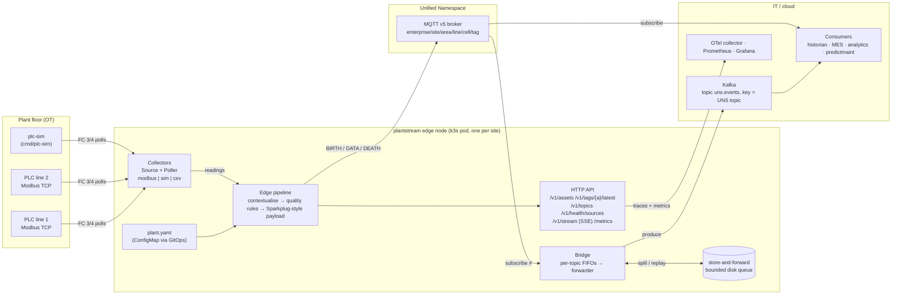
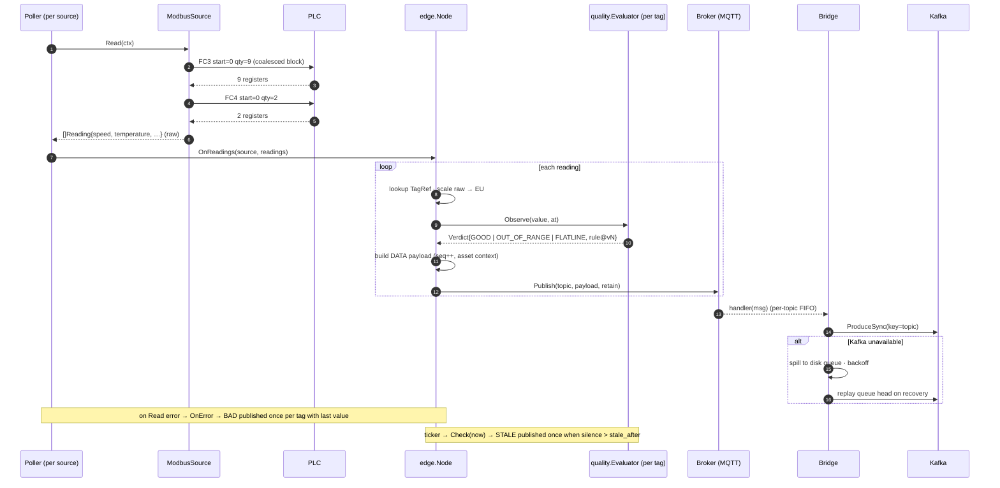

# Architecture

plantstream is one process per site that turns field-device registers into a
contextualised, quality-flagged Unified Namespace and forwards that namespace
to the cloud without losing data over WAN outages.

## Container view

Every box inside the edge node is a Go package with an in-memory twin for its
external dependency, so the full pipeline runs with `make run` and in the
test-suite without Docker.

| Package | Responsibility |
|---|---|
| `internal/domain/asset` | plant.yaml schema, defaults, exhaustive validation, lookup index |
| `internal/domain/uns` | topic hierarchy, MQTT filter matching, Sparkplug-B-inspired payload |
| `internal/domain/quality` | deterministic versioned rules: comm, range, flatline, stale |
| `internal/domain/linesim` | deterministic packaging-line model shared by plc-sim and the sim source |
| `internal/modbus` | Modbus TCP framing, FC 3/4 client + server, register codec |
| `internal/collectors` | `Source` interface, poller, health, modbus / sim / csv sources |
| `internal/edge` | pipeline: contextualise → quality → publish → latest-value cache |
| `internal/bridge` | MQTT → Kafka forwarder with store-and-forward and per-topic backpressure |
| `internal/ports` | `Broker`, `Sink`, `Queue` interfaces |
| `internal/adapters/{memory,mqtt,kafka,diskqueue}` | adapters for the ports |
| `internal/api/http` | read API, SSE stream, RED metrics, request ids |
| `internal/observability` | slog JSON, OTel tracing, Prometheus registry |
| `internal/config` | 12-factor env configuration |

## Hot path: one poll cycle

## Lifecycle

- **Startup:** load + validate plant.yaml → connect broker → publish a
  retained `BIRTH` per source listing every metric with its metadata → start
  pollers and the stale checker → start the bridge (replaying any queue left
  from a previous run) → serve HTTP.
- **Steady state:** one `DATA` message per tag per poll, retained, so late
  subscribers see the last value immediately.
- **Shutdown (SIGTERM):** stop pollers → publish `DEATH` per source → bridge
  flushes in-memory messages to the disk queue → HTTP drains within
  `PLANTSTREAM_SHUTDOWN_TIMEOUT`. The MQTT last will publishes a node-level
  `DEATH` if the process dies without a clean disconnect.

## Scaling model

The unit is the site. Each site gets one Helm release with its own
plant.yaml; a release runs one replica (a PLC must not be polled by two
processes). Fan-out scales in the consumers: they subscribe to the broker or
read Kafka. A single node comfortably handles thousands of tags at 1 Hz; the
bottlenecks are PLC response time (mitigated by request coalescing) and WAN
bandwidth (mitigated by the queue).

## Failure handling summary

| Failure | Behaviour | Signal |
|---|---|---|
| PLC unreachable | tags → `BAD` once with last value; poller retries each interval, reconnects on transport errors | `plantstream_source_up=0`, `/v1/health/sources` |
| Wrong register map (exception) | poll fails, connection kept | `last_error` shows the Modbus exception |
| Sensor frozen | `FLATLINE` if configured | `quality_transitions_total{rule="quality.flatline@v1"}` |
| Value outside range | `OUT_OF_RANGE` | `quality_transitions_total{rule="quality.range@v1"}` |
| Source silent | `STALE` after `stale_after` | `quality_transitions_total{rule="quality.stale@v1"}` |
| MQTT broker down | autopaho reconnects with backoff; publishes fail and are counted; `/readyz` → 503 | `plantstream_uns_publish_errors_total` |
| Kafka down | store-and-forward to bounded disk queue; replay on recovery | `bridge_sink_up=0`, `bridge_queue_depth` |
| Disk budget exhausted | oldest segment evicted, counted | `bridge_queue_evicted_total` |
| Sink slower than sources | per-topic coalescing (latest value wins) | `bridge_coalesced_total` |
| Process crash | k8s restarts; queue recovers from disk; BIRTH re-announces; LWT DEATH | `_edge/<node>/DEATH` |
